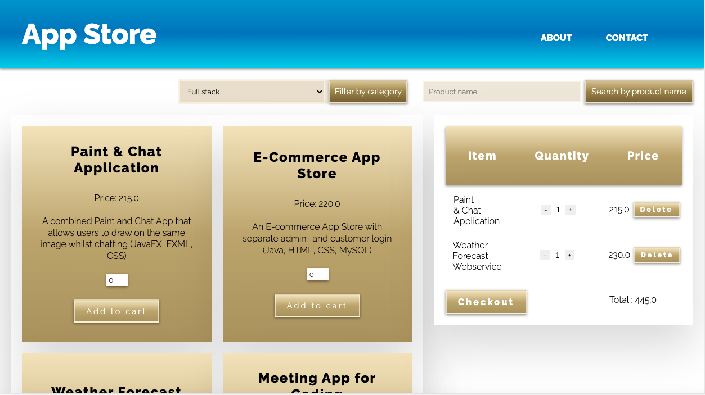
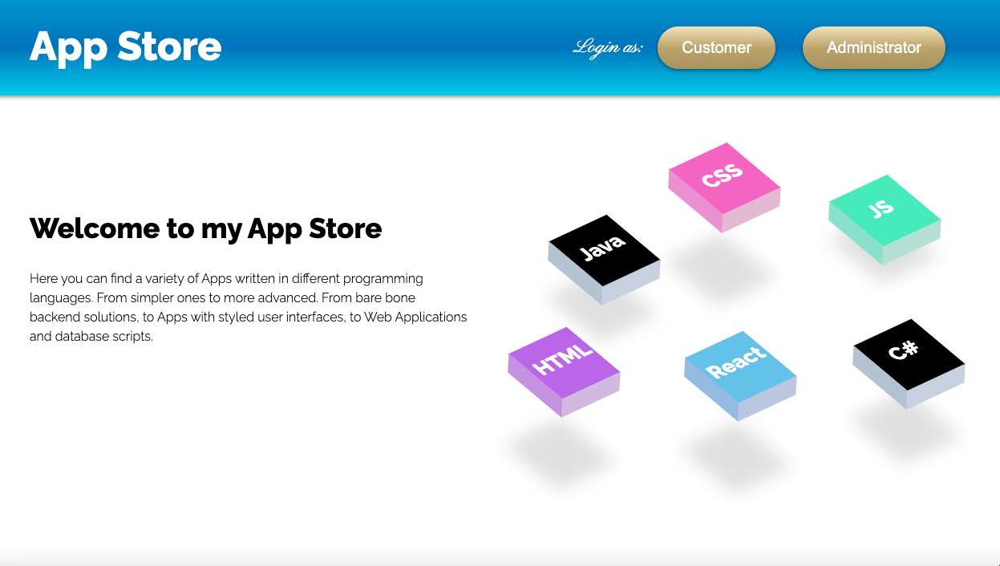
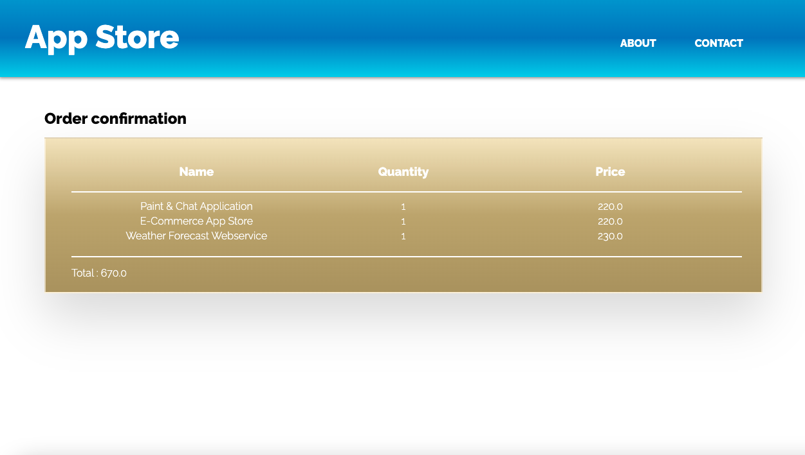

# App Store

## User Interface

---

## Description

A full stack E-Commerce App Store with separate login for customers and administrators. The customer can browse products and is able to filter products by category or search by product name, place products in cart and view updated subtotal as well as increase, decrease and delete products from the cart. Finally to check out and receive an order confirmation and an email with order details. Admin is able to view processed and unprocessed orders, mark orders as processed and add as well as update products in the system. Tests were added with JUnit.    

---

## Technologies used

- Spring Data Jpa
- Spring Boot
- MySQL
- Thymeleaf
- HTML
- CSS
- JUnit
- Animations

---

## More UI

